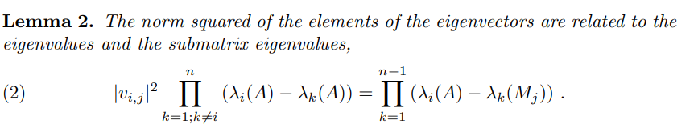

# New Eigenvectors from Eigenvalues Calculation
This repository implements this [paper](https://arxiv.org/pdf/1908.03795.pdf) that allows us to calculate eigenvectors from eigenvalues elegantly through PyTorch.

I ported this to PyTorch as a lot of my workflows are on the GPUs with PyTorch.

## Run Notebook on Google Colab
[](https://colab.research.google.com/github/ritchieng/eigenvectors-from-eigenvalues/blob/master/notebooks/comparison.ipynb)

## Authors and Abstract
PETER B. DENTON, STEPHEN J. PARKE, TERENCE TAO, AND XINING ZHANG

```
We present a new method of succinctly determining eigenvectors
from eigenvalues. Specifically, we relate the norm squared of the elements of
eigenvectors to the eigenvalues and the submatrix eigenvalues.
```

## Core Equation


This is the core equation you will notice being referenced as `equation 2` in the code.

## Dependencies
- PyTorch 1.9.1 (can be most versions of PyTorch as I used very core basic PyTorch functions)
- Python 3.8 (doesn't matter much as I use basic operations)

## Repository Citation
- If you would like to give some credit to this implementation, these are the relevant links.
    - [](https://zenodo.org/badge/latestdoi/221868248)
    - [Eigenvectors from Eigenvalues CPU and GPU Implementation](https://www.researchgate.net/publication/337322294_Eigenvectors_from_Eigenvalues_CPU_and_GPU_Implementation)

## License
MIT
